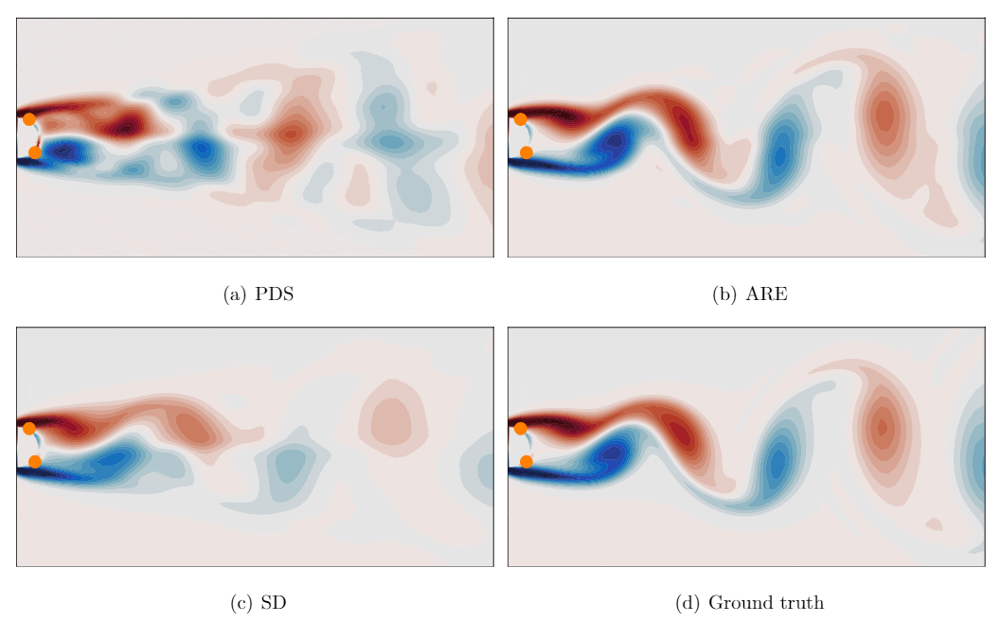
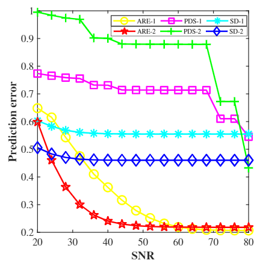
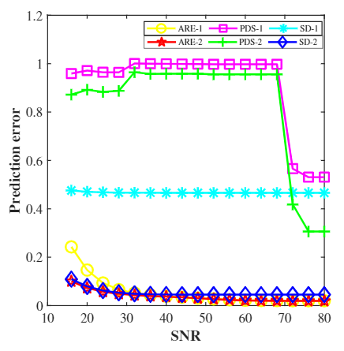

# ARE (Auto Recurrent Estimation)
*State estimation with limited sensors – A deep learning based approach*

*Yash Kumara, Pranav Bahla, Souvik Chakraborty*

---
  
| Schematic representation |
| ------------- |  
||

> In this paper, we propose a novel deep learning-based state estimation framework that learns from sequential data. The proposed model structure consists of the recurrent cell to pass information from different time steps, enabling this information to recover the full state. We illustrate that utilizing sequential data allows for state recovery from minimal and noisy sensor measurements. For efficient recovery of the state, the proposed approach is coupled with an auto-encoder based reduced-order model. We illustrate the performance of the proposed approach using three examples, and it is found to outperform other alternatives existingin the literature.

## Datasets Considered
* Transient Flow past a cylinder
* Periodic Vortex shedding past a cylinder
* NOAA Sea Surface Temp. Dataset

||   |
| ------------- | ------------- |
