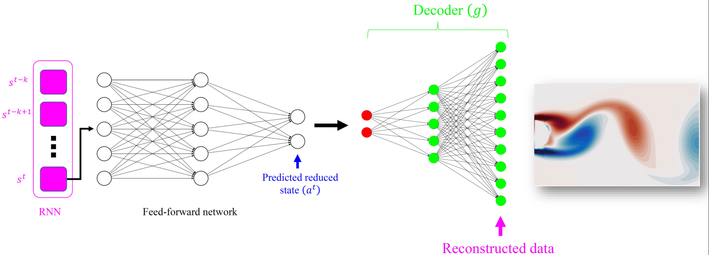

# ARE (Auto Recurrent Estimation)
*State estimation with limited sensors – A deep learning based approach*

*Yash Kumara, Pranav Bahla, Souvik Chakraborty*

---
  
| Schematic representation |
| ------------- |  
||

> The importance of state estimation in fluid mechanics is well-established; it is required for accomplishing several tasks, including design/optimization, active control, and future state prediction. A common tactic in this regard is to rely on reduced-order models. Such approaches, in general,  use measurement data of a one-time instance. However, often data available from sensors is sequential, and ignoring it results in information loss. In this paper, we propose a novel deep learning-based state estimation framework that learns from sequential data. The proposed model structure consists of the recurrent cell to pass information from different time steps, enabling this information to recover the full state.We illustrate that utilizing sequential data allows for state recovery from minimal and noisy sensor measurements. For efficient recovery of the state, the proposed approach is coupled with an auto-encoder based reduced-order model. We illustrate the performance of the proposed approach using four examples, and it is found to outperform other alternatives existing in the literature.

## Datasets Considered
* Transient Flow past a cylinder
* Periodic Vortex shedding past a cylinder
* NOAA Sea Surface Temp. Dataset
* 1D viscous Burgers’ equation


## Citation
Find this useful or like this work? Cite us with:
```latex
@article{KUMAR2022111081,
title = {State estimation with limited sensors – A deep learning based approach},
journal = {Journal of Computational Physics},
pages = {111081},
year = {2022},
issn = {0021-9991},
doi = {https://doi.org/10.1016/j.jcp.2022.111081},
url = {https://www.sciencedirect.com/science/article/pii/S0021999122001437},
author = {Yash Kumar and Pranav Bahl and Souvik Chakraborty},
keywords = {Limited sensors, LSTM, Autoencoders, state estimation}
}
```
---
